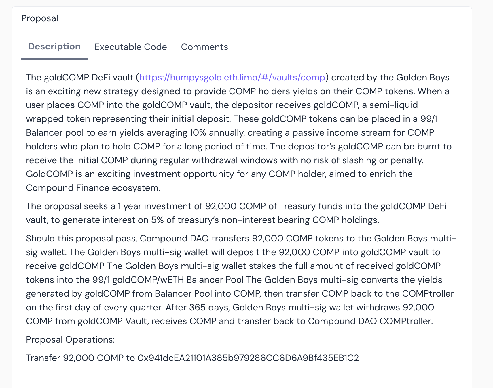

# DAOs 
## a) Identify a set of DAOs that are most vulnerable to an economic governance attack, describe how it may be achieved, and estimate the cost to the attacker.

DAOs that may be susceptible to the above attack include but not limited to Compound v2 protocol , Venus Core Pool, and LayerBank .

### How to achieve it 
Using the Compound protocol as an example, an attacker could create a proposal that would transfer a certain percentage of the COMP treasury to a multi-signature wallet that the attacker would claim is for the purpose of investing.
The attacker could potentially achieve this attack by accumulating a significant amount of COMP tokens.Once the attacker has amassed a substantial amount of COMP, they could delegate their tokens to accounts they control, effectively centralizing the voting power.
With a large enough voting stake, the attacker would be able to reach the quorum threshold required to pass proposals on the Compound DAO.The potential benefit for the attacker in this scenario would be the ability to siphon off a significant portion of the Compound DAO's treasury.

### Case Study : Humpy and the Golden Boys
A highly plausible attempted attack by [Humpy](https://etherscan.io/address/0x36cc7b13029b5dee4034745fb4f24034f3f2ffc6) to control part of Compound's COMP treasury with this proposal below;

This suspicion is fueled by the fact that there were 5 delegated voting accounts that followed the same withdraw pattern just a few days before the proposal;

[0x4f3a](https://etherscan.io/address/0x4f3a2bfd91761ac0d82261b82bb5c8ace4644a51)  - 42,695 COMP delegated

[0x9d03](https://etherscan.io/address/0x9d0361f5da754994c1df011e86469416d6f1ec31) - 40,012 COMP delegated

[0x93cb](https://etherscan.io/address/0x93cb8af7d9589f0ae34501391e8ea57850581a08)  - 39,188 COMP delegated

[0x4ac0](https://etherscan.io/address/0x4ac0dbce527bcb60787cef10053348b146c6b5e3)  - 48,724 COMP delegated

[0xc64c](https://etherscan.io/address/0xc64c27791b2355b3080721197b89602ac6c92b7b) - 59,714 COMP delegated

These five accounts collectively hold 230,333 COMP tokens, which is more than half of the 400,000 COMP quorum threshold required to pass a proposal.
There was potential for an attack had the 5 accounts and other similar accounts coordinated and voted in favour of the proposal . 

### estimate the cost to the attacker.
The attacker only needs to get enough token to achieve quorum threshold. For Compound that would be around 400,000 COMP tokens.

### estimate and describe the potential benefit for the attacker

Using the above mentioned case study as an example the attacker would gain control of 92,000 COMP tokens, which is approximately 5% of the Compound treasury.

Control over such a large amount of COMP could allow the attacker to influence COMP's market price in the attacker's favour . 

Could use the acquired funds to gain even more voting power creating a snowball effect .

