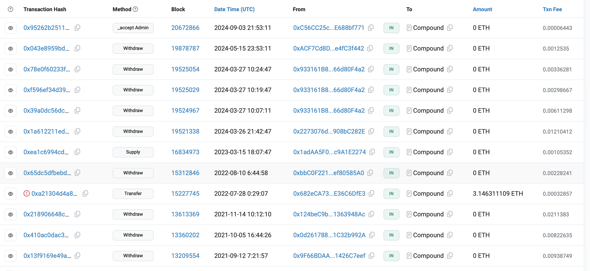
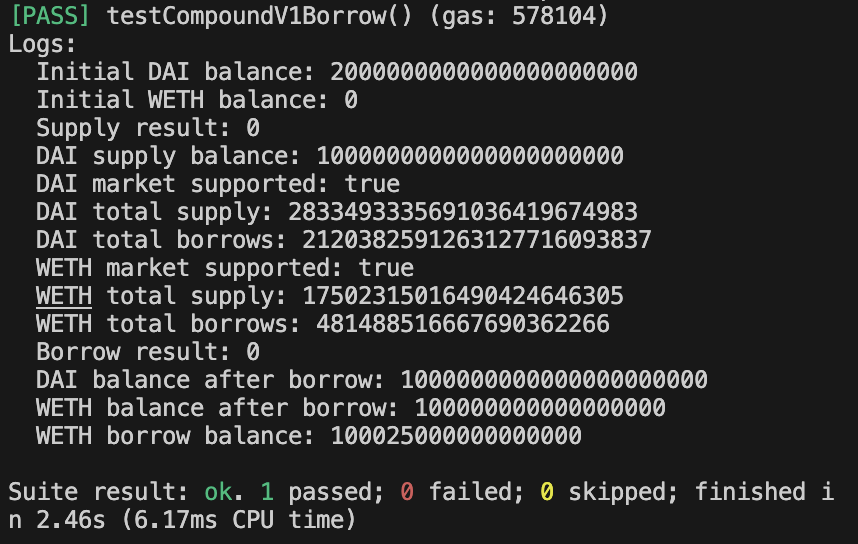
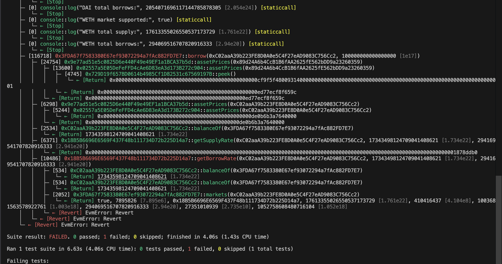

# Stale-Oracle

## a) Are the prices stale according to the view of Compound v1?
The contract is partially oparetional as withdrawal , supply and liquidation are still possible . Hence , the prices are not stale since the prices are being updated.

Contract not fully deprecated;




## b) Were markets paused in some way? Provide all necessary data to simulate the borrowing of any asset on June 5, 2019 to prove your point.

The markets were indeed paused in some way , as new Borrow transactions were disabled in Compound v1 . Here are two examples of transactions results .

1) First transaction passes on 3rd June ,2019 ; Block number => 7883176



2) Second transaction fails on 5th June, 2019 ; Block number => 7895899



All the above transaction simulations were done using the code available in ```stale-oracle/Simulation.sol``` file . Just change the block numbers when forking mainnet . 

