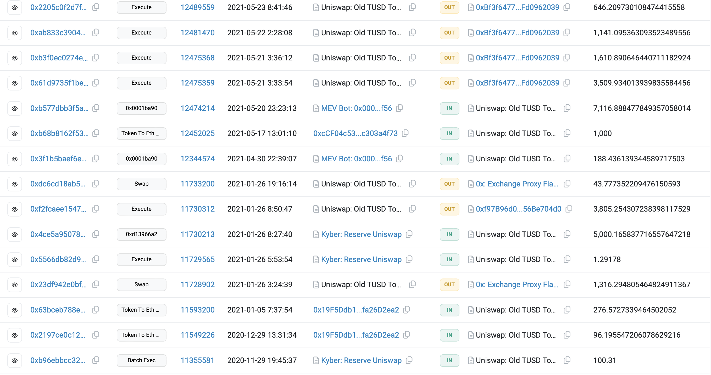
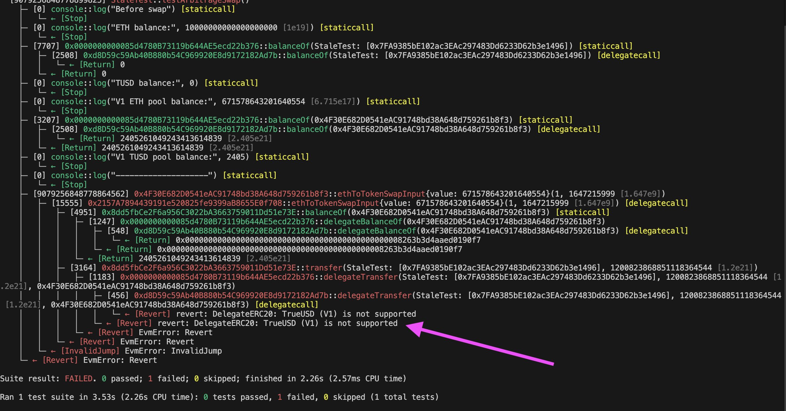

# Stale-amm

## a) What is the reason for the stale price in this pool?

Uniswap's v1 pool pricing model is based on a constant product formula, where the price of tokens is determined by the ratio of their reserves in the liquidity pool. Since there was infrequent trades in this pool , the token prices did not update quickly enough to reflect the prevailing market conditions at that time .This resulted in stale prices that did not accurately represent the real-time market value of the tokens .

infrequent transactions ;



## b) Provide all necessary simulation data to arbitrage the pool on January 23, 2022.
it is available in stale-amm/Simulation.sol

python code to get block number on a given date ;
```python
# CODE TO CHECK THE FIRST BLOCK NUMBER ON INPUTED DATE . IN SHORT SEARCH FOR BLOCK NUMBER BY DATE
import requests
import time


date = "2022-01-23"

timestamp = int(time.mktime(time.strptime(date, "%Y-%m-%d")))


url = f"https://api.etherscan.io/api?module=block&action=getblocknobytime&timestamp={timestamp}&closest=before&apikey=API_KEY"


response = requests.get(url)
data = response.json()


if data["status"] == "1":
    latest_block_number = int(data["result"])
    print(f"Latest block number on {date}: {latest_block_number}")
else:
    print(f"Error: {data['message']}")

 ```
 ## c) Could you execute the arbitrage on March 14, 2022? If not, explain why.
On March 14 , 2022 TrueUSD is no longer supported in that pool making it impossible to arbitrage it .




