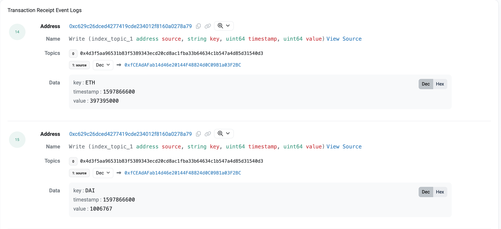

# Liquidation 
Before the open price feed [proposal](https://compound.finance/governance/proposals/19) , liquidators had to wait for the prices to be manually updated by the Compound team or designated operators.

After the [proposal](https://compound.finance/governance/proposals/19) took effect , any address could post reported prices since no privilege is required to post them. As long as these posted prices were within 20% of the Uniswap TWAP for that asset. Once posted it is immediately available for use in the Protocol .

The [liquidator](https://etherscan.io/tx/0xec4f2ab36afa4fac4ba79b1ca67165c61c62c3bb6a18271c18f42a6bdfdb533d) started to test it out by posting prices .

Price change after posting ;

## a) What’s the edge of this liquidator that allows them to win more liquidations?

While other liquidators waited for the prices to be updated, this [liquidator](https://etherscan.io/tx/0xec4f2ab36afa4fac4ba79b1ca67165c61c62c3bb6a18271c18f42a6bdfdb533d) found out that in a single transaction he/she could both change the prices of underlying assets there by lowering a borrower's collateral ratio and then liquidating the borrower . 

## b) When you figure out the source of the edge, you notice that their calldata is extremely obfuscated. Can you explain on how the calldata works?

From the transaction data and logs , the liquidator first calls a contract and from there we can observe the following ;

1) The contract successfully posts prices for both ETH and DAI  lowering ETH to 
397395000 and raising the price of DAI to 1006767.

2) Gets DAI's address and checks its own balance, the borrow balanceStored and then the borrower's CEther balance 

3) The contract calls the ``liquidateBorrow()`` function liquidating the borrower and finally calls  GasToken2 to lower its gas

Here is the full transaction data:

the solidity bot and the necessary information to simulate this liquidation is in the liquidation/Simulation.sol file 

 