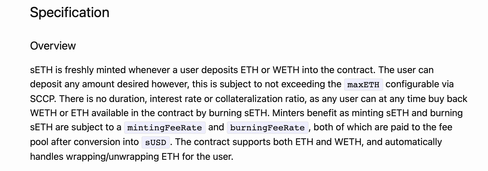
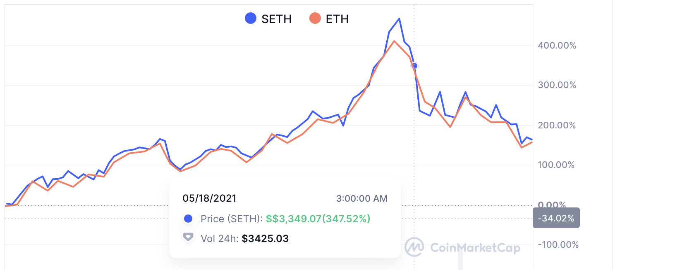
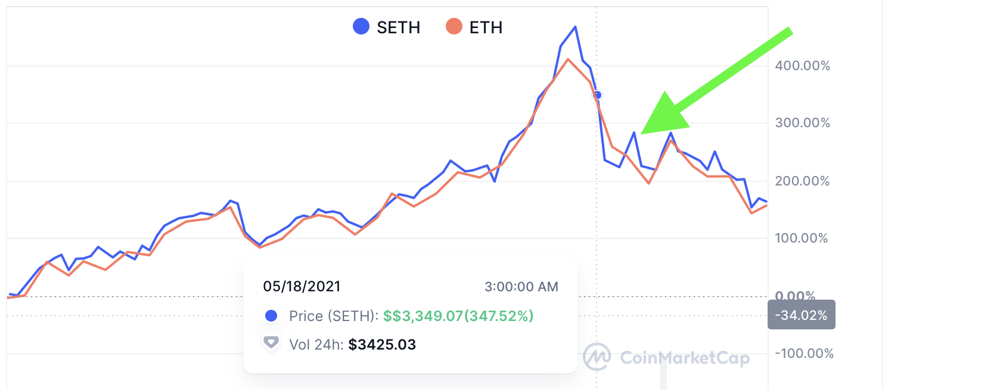
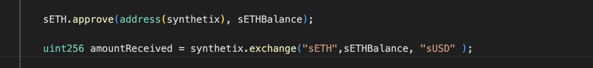
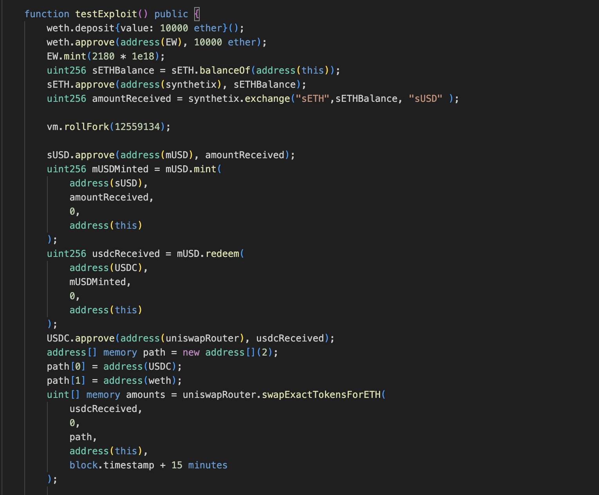

# Long-Tail-Enjoyor
According to this SIP, a user could deposit any amount of ETH or WETH into the provided contracts, provided they do not go beyond the maxETH.

## How, in theory, can you make money based on the SIP specification?
The protocol assumes that the sETH would always be pegged to ETH or WETH. Since there is no mechanism to delay withdrawal when such a scenario occurs, you can take advantage of this by waiting for a time when sETH depegs and is trading at a higher market price than ETH. This will allow you to maximize your profit, even after accounting for minting and burning fees.

## Steps

Get sETH for an equal amount of ETH from the contracts.
Get ETH and trade it for sETH from around 13-5-2021 to 18-5-2021.

Wait for the depegging. You may use SIM studio to get notifications on such events.

Exchange the initially acquired sETH for sUSD on Synthetix's own exchange.

Swap the sUSD for USDC on Uniswap or any other DEX .

Use the USDC to buy more ETH.
 
 here's the exploit code ;

The whole Simulation is in the Simulation.sol file 

